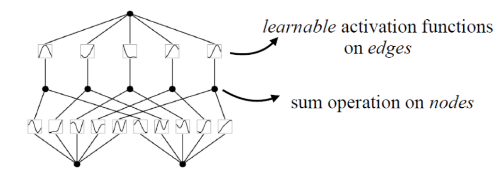
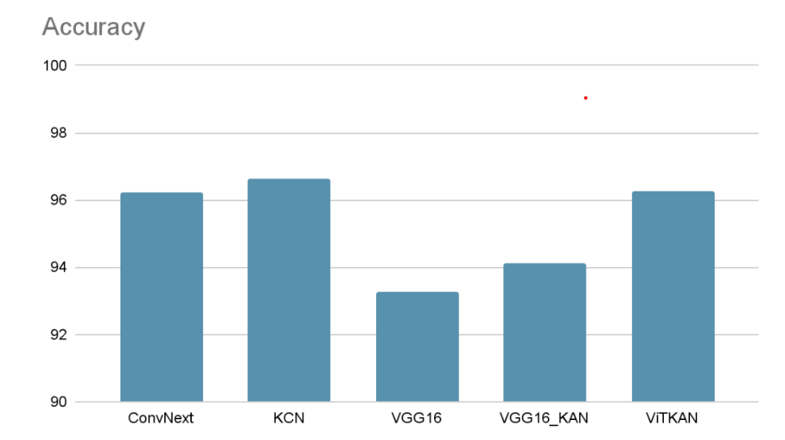

# Kolmogorov-Arnold Network for Satellite Image Classification in Remote Sensing

## Overview
The rapid growth of remote sensing technologies has resulted in high-resolution datasets essential for environmental monitoring, urban planning, agriculture, and disaster management. Traditional deep learning models trained on these datasets often require large computational resources, longer training times, and risk overfitting due to the high complexity of satellite images.

To address these challenges, this project explores **Kolmogorov-Arnold Networks (KAN)**, which replace traditional MLP heads with learnable **B-spline activation functions**. This architecture enhances model flexibility, reduces parameter overhead, and improves generalization. The proposed approach integrates KAN with ConvNeXt and compares its performance against other pre-trained models such as **MobileNetV2**, **EfficientNet-B0**, and **Vision Transformer (ViT)**.

---

## Objectives
1. Implement the **Kolmogorov-Arnold Network (KAN)** to replace the traditional MLP heads in ConvNeXt and other pre-trained models.
2. Evaluate the effectiveness of KAN on remote sensing classification tasks.
3. Compare performance metrics (accuracy, generalization, and parameter efficiency) across different models and datasets.

---

## Kolmogorov-Arnold Representation Theorem
The Kolmogorov-Arnold theorem states that any multivariate continuous function can be represented as a finite composition of continuous functions of a single variable. 

**Role in KAN:**
- KAN implements this theoretical foundation using **learnable activation functions** modeled via **B-splines**.
- B-spline functions are parameterized and trained during the learning process, allowing the network to adaptively learn complex functional relationships.

### Key Features of KAN Implementation:
- **Basis Functions**: SiLU (Sigmoid Linear Unit) activation.
- **B-spline Functions**: Learnable coefficients enabling adaptive activation behavior tailored to the dataset.

---

## Model Architecture
The project integrates KAN with ConvNeXt and other pre-trained models (ResNet101, MobileNetV2, EfficientNet-B0, ViT) for comparison.

- **KAN-ConvNeXt (KCN)**: The traditional MLP classifier in ConvNeXt is replaced with **two KANLinear layers**.
- **KANLinear Layer**: Combines learnable B-splines and basis functions to achieve parameter efficiency and improved performance.

---

## Dataset
### EuroSAT Dataset
- A remote sensing dataset consisting of **10 classes**:
  - Annual crop
  - Forest
  - Herbaceous vegetation
  - Highway
  - Industrial
  - Pasture
  - Permanent crop
  - Residential
  - River
  - Sea/Lake
- **Data Split**:
  - **70%** Training
  - **30%** Testing

---

## Results 

### Evaluation metrics for KCN

